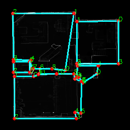

# Connecting the Dots: Floorplan Reconstruction Using Two-Level Queries

Testing RoomFormer on a sample point cloud. Original repository can be found here: [[Project Webpage](https://ywyue.github.io/RoomFormer/)]


## Level 1

Input          |  Output | Floorplan
:-------------------------:|:-------------------------: |:-------------------------:
 |  | 
## Level 2

Input          |  Room Map | Floorplan
:-------------------------:|:-------------------------:|:-------------------------:
 |  |  

 
 
## Citation
If you find RoomFormer useful in your research, please cite our paper:
```
@inproceedings{yue2023connecting,
  title     = {{Connecting the Dots: Floorplan Reconstruction Using Two-Level Queries}},
  author    = {Yue, Yuanwen and Kontogianni, Theodora and Schindler, Konrad and Engelmann, Francis},
  booktitle = {IEEE/CVF Conference on Computer Vision and Pattern Recognition (CVPR)},
  year      = {2023}
}
```
